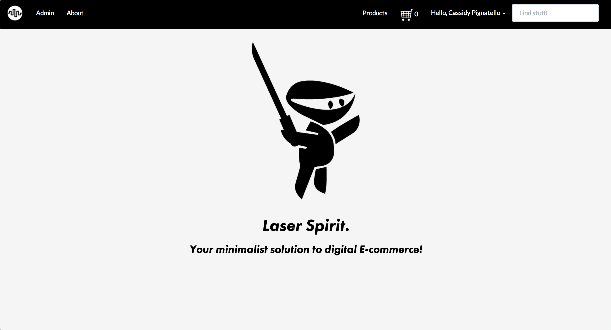

# Flatiron General Store

## Description

Laser Spirit is a digital goods store that lets you create and display products, collect orders and checkout through the shopping cart, and manage the orders through the administrative back end.

## Screenshots

## Background

We created Laser Spirit as a Rails engine to provide a simple way to sell digital goods in your host application.

## Features

- Product image upload to Amazon s3
- Solr for high powered search and indexing
- Easy checkout through Stripe
- Customer Order view
- Full admin backend where you can view and manage orders and edit products

## Usage

[Laser Spirit](laserspirit.ninja) is currently hosted as an example storefront that demonstrates the capabilities of Stripe Checkout.

## Development/Contribution

Feel free to fork our repo and customize it to your needs, or send over a pull request with anything you'd like to contribute!

## Author

Built by [Zack Sheppard](https://twitter.com/zackshp), [Dan Sullivan](https://twitter.com/dsully360), [Cassidy Pignatello](https://twitter.com/itscassidy) and [Bianca Tompkins](https://twitter.com/bitompkins) at The Flatiron School.

## License

Laser Spirit is MIT Licensed. See LICENSE for details.